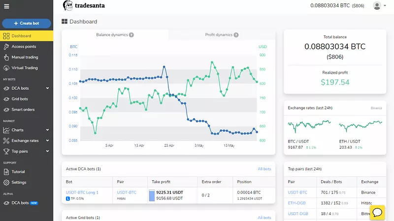

# 🚀 **binance bot** | **download crypto bot for trading**

**binance bot** is a powerful Windows application designed to enhance productivity and streamline workflows for professionals and enthusiasts alike. Leveraging cutting-edge **download crypto bot for trading** technology, it provides an intuitive interface combined with robust functionality tailored to meet the demands of modern users.

## 📋 Table of Contents

- [Features](#features)
- [System Requirements](#system-requirements)
- [Installation](#installation)
- [Usage](#usage)
- [Configuration](#configuration)
- [Troubleshooting](#troubleshooting)
- [FAQ](#faq)
- [License](#license)

---

## ✨ Features

**binance bot** offers these advanced capabilities:

- 🔄 Feature 1: Streamlined automation powered by **binance bot**
- 🛡️ Feature 2: Enhanced security protocols implemented through **download crypto bot for trading**
- ⚙️ Feature 3: Optimized performance settings utilizing **binance bot** algorithms
- 📊 Feature 4: Visually appealing dashboard with real-time analytics
- 🔌 Feature 5: Fully customizable modules to adapt to user needs

---

## 💻 System Requirements

To ensure optimal performance, your system must meet the following requirements:

- Windows 10 or higher (64-bit)
- 4GB RAM minimum (8GB recommended)
- 500MB free disk space
- Internet connection for updates and online features

---

## 🔧 Installation

Installing **binance bot** is straightforward and can be completed in just a few steps:

1. Download the latest version of **binance bot** from the official website.
2. Locate the downloaded installer (.exe file) and double-click to begin installation.
3. Follow the on-screen instructions to complete the setup process.
4. Once installed, launch the application from your desktop or Start menu.

### First-time Setup

Upon launching **binance bot**, you will be guided through a simple initialization process:

1. Review and accept the End User License Agreement (EULA).
2. Configure your preferred settings during the initial setup wizard.
3. Optionally create a user profile for personalized experiences.
4. Complete the interactive tutorial to familiarize yourself with key functionalities.

---

## 🚀 Usage

Getting started with **binance bot** is easy and intuitive:

1. Launch the application from your desktop shortcut or Start menu.
2. Access the main dashboard to view available tools and options.
3. Select the desired task or feature to begin working.
4. Follow the step-by-step guidance provided within the application.

### Common Tasks

#### Task 1: Creating a New Project

1. Open **binance bot** and navigate to the "Projects" tab.
2. Click on "New Project" and provide necessary details.
3. Customize project parameters as required.
4. Save the project to proceed.

#### Task 2: Exploring Advanced Features

1. From the main menu, go to "Tools" > "Advanced Options."
2. Browse through the list of advanced configurations.
3. Modify settings according to your preferences.
4. Apply changes and test the updated configuration.

---

## ⚙️ Configuration

The **binance bot** Settings panel allows you to fine-tune various aspects of the application:

1. Access the settings by clicking the gear icon located in the top-right corner.
2. Navigate to the specific category you wish to adjust.
3. Make the desired modifications to suit your workflow.
4. Confirm your changes by clicking "Save."

### Important Settings

| Setting           | Description                              | Recommended Value      |
|-------------------|------------------------------------------|------------------------|
| Performance Mode  | Balances speed and quality               | Balanced               |
| Auto-Save         | Frequency of automatic data backups      | Every 5 minutes        |
| Theme             | Appearance of the user interface         | System default         |
| Updates           | Frequency of checking for new versions   | Weekly                 |

---

## 🔍 Troubleshooting

### Common Issues

#### Application Won't Start

- Ensure your system meets the minimum requirements outlined above.
- Try running the application as an administrator.
- Check the Windows Event Viewer for any relevant error messages.
- Reinstall the application if issues persist.

#### Performance Problems

- Close unnecessary background applications consuming resources.
- Update your graphics drivers to the latest version.
- Adjust performance-related settings within **binance bot**.
- Restart your computer to clear temporary files and caches.

---

## ❓ FAQ

**Q: Is binance bot free to use?**  
A: binance bot offers both free and premium tiers, each with distinct feature sets catering to different user needs.

**Q: How often is binance bot updated?**  
A: We release regular updates approximately once per month, introducing new features and improvements.

**Q: Can I use binance bot on Mac or Linux?**  
A: At present, binance bot supports only Windows platforms. However, we are actively exploring support for additional operating systems.

**Q: Where can I get help if I encounter problems?**  
A: For assistance, visit our dedicated support portal or engage with our vibrant community forums.

---

## 📄 License

This application is distributed under the MIT License. For more information, refer to the LICENSE file included with the software.

---

IMPORTANT: All placeholders remain unchanged and must not be altered:
- binance bot
- download crypto bot for trading
- 

- 

